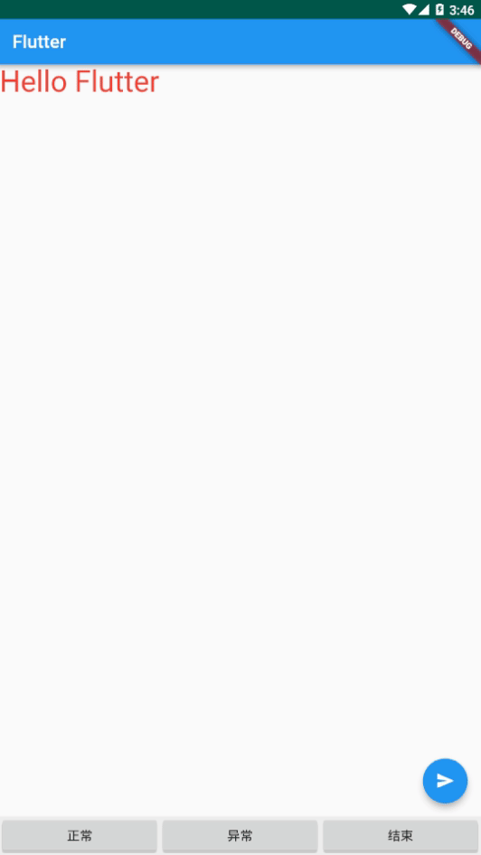

### 1.效果展示



### 2.集成Flutter

#### 2.1新建一个Flutter项目，类型选择Flutter Module,路径选择Android项目同级，不要在Android项目中创建

#### 2.2在Android项目中的settings.gradle配置flutter module，添加如下代码

```groovy
setBinding(new Binding([gradle: this]))
evaluate(new File(settingsDir.parentFile, 'flutter01/.android/include_flutter.groovy'))
```

#### 2.3添加flutter依赖

在app module下的build.gradle中添加flutter依赖，代码如下:

```groovy
dependencies {
    implementation project(':flutter')
}
```

<!-- more -->

### 3.将flutter中的widget显示在Android界面中

#### 3.1在flutter中写个hello world，代码如下

```dart
import 'package:flutter/material.dart';

void main() => runApp(MyApp());

class MyApp extends StatelessWidget {

  @override
  Widget build(BuildContext context) {
    return MaterialApp(
        home: Scaffold(
            appBar: AppBar(title: Text('Flutter')),
            body: Text(txt,
                style: TextStyle(color: Colors.red, fontSize: 32))
        ));
  }

  void sendData() {
    methodPlugin.invokeMethod('toast', 'Flutter send data');
    print('send data');
  }
}
```

#### 3.2在Android界面中显示flutter widget

获取到flutter widget并添加到viewgroup中，代码如下:

```java
public class MainActivity extends AppCompatActivity {
    private FrameLayout fl;

    @Override
    protected void onCreate(Bundle savedInstanceState) {
        super.onCreate(savedInstanceState);
        setContentView(R.layout.activity_main);
        fl = findViewById(R.id.fl);
        FlutterView flutterView = Flutter.createView(this, getLifecycle(), "route01");
        fl.addView(flutterView);
    }
}
```

#### 3.3解决首次加载黑屏问题

我们可以等View绘制完后再显示出来，首先将ViewGroup隐藏设置invisible，注意不能设置为gone,设置为gone后view不会绘制。将flutterView添加到viewGroup后监听第一帧页面的绘制，等第一帧绘制完后，再将viewgroup显示出来，代码如下:

```java
public class MainActivity extends AppCompatActivity {
    private FrameLayout fl;

    @Override
    protected void onCreate(Bundle savedInstanceState) {
        super.onCreate(savedInstanceState);
        setContentView(R.layout.activity_main);
        fl = findViewById(R.id.fl);
        FlutterView flutterView = Flutter.createView(this, getLifecycle(), "route01");
        fl.addView(flutterView);
        showFlutterView(flutterView);
    }

    private void showFlutterView(FlutterView flutterView) {
        flutterView.addFirstFrameListener(new FlutterView.FirstFrameListener() {
            @Override
            public void onFirstFrame() {
                flutterView.removeFirstFrameListener(this);
                fl.setVisibility(View.VISIBLE);
            }
        });
    }
}
```

### 4.接收flutter发送的消息

Android中通过`MethodChannel`来接收Flutter的消息，代码如下

```java
public class Demo {
    public void use() {
        new MethodChannel(flutterView, "flutter").setMethodCallHandler((methodCall, result) -> {
            switch (methodCall.method) {
                case "toast":
                    fl.post(() -> Toast.makeText(MainActivity.this, methodCall.arguments(), Toast.LENGTH_SHORT).show());
                    break;
            }
        });
    }
}
```

`new MethodChannel(flutterView, "flutter")`
中的第一个参数为FlutterView,是指消息从哪个View发送的，第二个参数为通道名称，发送消息前需要建立一个通道，在这个通道中发送消息。`methodCall.method`
为消息类型，用于区分不能的消息，`methodCall.arguments`为消息数据。  
flutter也是通过`MethodChannel`来发送消息，示例中的效果为点击右下角的图标，发送一条消息给android，android接收到消息后，用toast显示，发送消息的代码如下:

```dart
import 'package:flutter/material.dart';
import 'package:flutter/services.dart';

void main() => runApp(MyApp());

class MyApp extends StatelessWidget {
  static const methodPlugin = const MethodChannel('flutter');

  @override
  Widget build(BuildContext context) {
    return MaterialApp(
        home: Scaffold(
          appBar: AppBar(title: Text('Flutter')),
          body: Text(txt,
              style: TextStyle(color: Colors.red, fontSize: 32)),
          floatingActionButton: FloatingActionButton(
            onPressed: sendData,
            child: Icon(Icons.send),
          ),
        ));
  }

  void sendData() {
    methodPlugin.invokeMethod('toast', 'Flutter send data');
  }
}
```

### 5.Android发送消息给flutter

android中通过`EventChannel`来给flutter发送消息，代码如下:

```java
public class Demo {
    public void use() {
        new EventChannel(flutterView, "android").setStreamHandler(new EventChannel.StreamHandler() {
            @Override
            public void onListen(Object o, EventChannel.EventSink eventSink) {

            }

            @Override
            public void onCancel(Object o) {

            }
        });
    }
}
```

`new EventChannel(flutterView, "android")`；中的第一个参数为接收消息的对象，第二个参数为通道名称，最后通过`EventChannel.EventSink`
对象来发送消息。可以发送一条成功的消息，`eventSink.success("success")`；也可以发送一条异常消息，`eventSink.error("1000", "数据异常", "数据解析异常")`
，第一个参数为状态码，第二个参数为异常内容，第三个参数的异常详情；也可以发送一个结束信号，`eventSink.endOfStream();`。  
flutter接收消息代码如下:

```dart
class Demo {
  void use() {
    EventChannel('android')
        .receiveBroadcastStream()
        .listen(onData, onError: error, onDone: done, cancelOnError: false);
  }
}
```

其中listen中的前几个参数均为一个方法，第一个接收成功消息，第二个接收异常消息，第三个接收结束信号，第四个参数是当接收到异常消息后，是否停止消息的接收，当为false时，接收到异常消息后，仍可以继续接收消息。

### 6.完整示例代码

activity中的示例代码如下

```java
public class MainActivity extends AppCompatActivity {
    private EventChannel.EventSink event;
    private FrameLayout fl;

    @Override
    protected void onCreate(Bundle savedInstanceState) {
        super.onCreate(savedInstanceState);
        setContentView(R.layout.activity_main);
        fl = findViewById(R.id.fl);
        FlutterView flutterView = Flutter.createView(this, getLifecycle(), "route01");
        fl.addView(flutterView);

        showFlutterView(flutterView);
        receiveFlutterData(flutterView);
        new EventChannel(flutterView, "android").setStreamHandler(new EventChannel.StreamHandler() {
            @Override
            public void onListen(Object o, EventChannel.EventSink eventSink) {
                event = eventSink;
            }

            @Override
            public void onCancel(Object o) {
                Log.i("aloe", o.toString());
            }
        });
    }

    private void showFlutterView(FlutterView flutterView) {
        flutterView.addFirstFrameListener(new FlutterView.FirstFrameListener() {
            @Override
            public void onFirstFrame() {
                flutterView.removeFirstFrameListener(this);
                fl.setVisibility(View.VISIBLE);
            }
        });
    }

    private void receiveFlutterData(FlutterView flutterView) {
        new MethodChannel(flutterView, "flutter").setMethodCallHandler((methodCall, result) -> {
            switch (methodCall.method) {
                case "toast":
                    fl.post(() -> Toast.makeText(MainActivity.this, methodCall.arguments(), Toast.LENGTH_SHORT).show());
                    break;
            }
        });
    }

    public void onClick(View view) {
        switch (view.getId()) {
            case R.id.btn_success:
                event.success("Android send data");
                break;
            case R.id.btn_fail:
                event.error("1000", "数据异常", "数据解析异常");
                break;
            case R.id.btn_finish:
                event.endOfStream();
                break;
            default:
                break;
        }
    }
}
```

flutter中的示例代码如下

```dart
import 'package:flutter/material.dart';
import 'package:flutter/services.dart';

void main() => runApp(MyApp());

class MyApp extends StatelessWidget {
  static const methodPlugin = const MethodChannel('flutter');

  @override
  Widget build(BuildContext context) {
    return MaterialApp(
        home: Scaffold(
          appBar: AppBar(title: Text('Flutter')),
          body: MyView(),
          floatingActionButton: FloatingActionButton(
            onPressed: sendData,
            child: Icon(Icons.send),
          ),
        ));
  }

  void sendData() {
    methodPlugin.invokeMethod('toast', 'Flutter send data');
  }
}

class MyView extends StatefulWidget {
  @override
  State<StatefulWidget> createState() {
    return MyState();
  }
}

class MyState extends State<MyView> {
  static const eventPlugin = const EventChannel('android');
  String txt = 'Hello Flutter';

  @override
  void initState() {
    super.initState();
    eventPlugin
        .receiveBroadcastStream()
        .listen(onData, onError: error, onDone: done, cancelOnError: false);
  }

  @override
  Widget build(BuildContext context) {
    return Text(txt,
        style: TextStyle(color: Colors.red, fontSize: 32));
  }

  void updateTxt(String text) {
    setState(() {
      txt = text;
    });
  }

  void onData(Object data) {
    print(data);
    updateTxt(data);
  }

  void error(Object error) {
    PlatformException e = error;
    updateTxt('code: ${e.code}, msg: ${e.message}, detail: ${e.details}');
  }

  void done() {
    updateTxt('Hello Flutter');
  }
}
```

android发送消息，flutter用Text来展示，flutter发送消息，android用toast来提示，其它布局代码不是很复杂，在此不作展示。