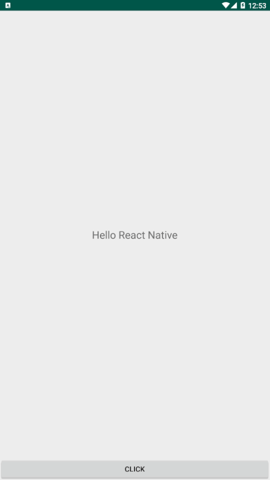

### 1.效果展示



### 2.集成RN

#### 2.1创建并依赖RN

首先用idea创建一个react native项目，选择File->New->Project,类型选择Static Web->React
Native。创建完成后，将android目录下的文件全删除，用自己的Android项目代码代替。然后在android项目根目录下的build.gradle中添加依赖。

```groovy
allprojects {
    repositories {
        maven { url "$rootDir/../node_modules/react-native/android" }
    }
}
```

在app module下的build.gradle中添加依赖。

```groovy
dependencies {
    implementation "com.facebook.react:react-native:0.58.6"
}
```

#### 2.2配置加载JSBundle环境

如果targetSdkVersion为28，则需配置http请求权限，在src目录下创建文件debug/res/xml/network_security_config.xml,内容如下。

```xml
<?xml version="1.0" encoding="utf-8"?>
<network-security-config>
    <domain-config cleartextTrafficPermitted="true">
        <domain includeSubdomains="false">localhost</domain>
        <domain includeSubdomains="false">10.0.2.2</domain>
        <domain includeSubdomains="false">10.0.3.2</domain>
    </domain-config>
</network-security-config>
```

在src目录下创建文件release/res/xml/network_security_config.xml,内容如下:

```xml
<?xml version="1.0" encoding="utf-8"?>
<network-security-config>
    <domain-config cleartextTrafficPermitted="false">
        <domain includeSubdomains="false">localhost</domain>
        <domain includeSubdomains="false">10.0.2.2</domain>
        <domain includeSubdomains="false">10.0.3.2</domain>
    </domain-config>
</network-security-config>
```

在AndroidManifest.xml文件中的applicati标签下配置networkSecurityConfig属性，还得配置网络权限和DevSettingsActivity，主要代码如下:

```xml

<manifest xmlns:android="http://schemas.android.com/apk/res/android">
    <uses-permission android:name="android.permission.INTERNET"/>
    <application android:networkSecurityConfig="@xml/network_security_config">
        <activity android:name="com.facebook.react.devsupport.DevSettingsActivity"/>
    </application>
</manifest>
```

<!-- more -->

#### 2.3生成JSBundle

先在main目录下创建assets目录，然后在idea控制台中输入如下代码生成JSBundle。

```
react-native bundle --platform android --dev false --entry-file index.js --bundle-output android/app/src/main/assets/index.android.bundle --assets-dest android/app/src/main/res/
```

#### 2.4加载JSBundle

我们将RN解析出的View用FrameLayout来加载，xml布局在此省略，activity中的代码如下:

```java
public class MainActivity extends AppCompatActivity implements DefaultHardwareBackBtnHandler {
    private ReactInstanceManager manager;
    private ReactRootView rootView;

    @Override
    protected void onCreate(Bundle savedInstanceState) {
        super.onCreate(savedInstanceState);
        setContentView(R.layout.activity_main);
        manager = ReactInstanceManager.builder()
                .setApplication(getApplication())
                .setBundleAssetName("index.android.bundle")
                .addPackage(new MainReactPackage())
                .setUseDeveloperSupport(BuildConfig.DEBUG)
                .setInitialLifecycleState(LifecycleState.RESUMED)
                .build();
        rootView = new ReactRootView(this);
        rootView.startReactApplication(manager, "rn01", null);
        FrameLayout fl = findViewById(R.id.fl);
        fl.addView(rootView);
    }

    @Override
    public void invokeDefaultOnBackPressed() {
        super.onBackPressed();
    }

    @Override
    public void onBackPressed() {
        if (manager != null) {
            manager.onBackPressed();
        } else {
            super.onBackPressed();
        }
    }

    @Override
    protected void onPause() {
        super.onPause();
        if (manager != null) {
            manager.onHostPause(this);
        }
    }

    @Override
    protected void onResume() {
        super.onResume();
        if (manager != null) {
            manager.onHostResume(this, this);
        }
    }

    @Override
    protected void onDestroy() {
        super.onDestroy();
        if (manager != null) {
            manager.onHostDestroy(this);
        }
        if (rootView != null) {
            rootView.unmountReactApplication();
        }
    }
}
```

`startReactApplication`方法的值应与RN项目目录下的app.json文件中的name值一样。在开发过程中，我们可以用idea来编辑RN项目，用Android
Studio来编辑android项目。现在将android项目运行到手机上看看效果。

### 3.Android给RN发消息

我们在布局中加一个按钮，点击时将我们的名字发个RN，RN用Text来显示我们发送的内容，我们需要获取到`RCTDeviceEventEmitter`，并用`RCTDeviceEventEmitter`来发送消息，代码如下:

```java
public class Demo {
    public void use() {
        ReactContext reactContext = manager.getCurrentReactContext();
        if (reactContext != null) {
            reactContext.getJSModule(DeviceEventManagerModule.RCTDeviceEventEmitter.class).emit("androidLog", "ALOE");
        }
    }
}
```

第一个参数为消息名称，第二个参数为消息内容，若有多条数据需要发送，可以将参数封装到`WritableMap`或`WritableArray`中进行发送。然后我们需要在RN中监听此消息，App.js代码如下:

```js
import React, {Component} from 'react';
import {DeviceEventEmitter, StyleSheet, Text, View} from 'react-native';

export default class App extends Component {
    constructor(props) {
        super(props);
        this.state = {
            name: 'React Native'
        };
    }

    render() {
        DeviceEventEmitter.addListener('androidLog', (data) => {
            this.setState(previousState => {
                previousState.name = data;
                return previousState;
            });
        });
        return (
            <View style={styles.container}>
                <Text style={styles.hello}>Hello {this.state.name}</Text>
            </View>
        );
    }
};

var styles = StyleSheet.create({
    container: {
        flex: 1,
        alignItems: 'center',
        justifyContent: 'center',
    },
    hello: {
        fontSize: 20,
        textAlign: 'center',
        margin: 10,
    },
});
```

`addListener`的第一个参数为消息名称，需与Android发送消息的名称一致。当我们收到Android消息后，将页面内容改为Hello加Android发送的内容。

### 4.RN给Android发消息

#### 4.1创建模块

首先要创建一个模块`ReactContextBaseJavaModule`子类，我们以Toast模块为例，代码如下:

```java
public class ToastModule extends ReactContextBaseJavaModule {
    public ToastModule(ReactApplicationContext reactContext) {
        super(reactContext);
    }

    @Override
    public String getName() {
        return "ToastModule";
    }

    @ReactMethod
    public void show(String msg, int duration) {
        Toast.makeText(getReactApplicationContext(), msg, duration).show();
    }

    @Nullable
    @Override
    public Map<String, Object> getConstants() {
        Map<String, Object> map = new ArrayMap<>();
        map.put("SHORT", Toast.LENGTH_SHORT);
        map.put("LONG", Toast.LENGTH_LONG);
        return map;
    }
}
```

`getName`方法返回模块名称，我们需要提供一个方法让RN调用，该方法必须用`@ReactMethod`标记，如示例中的`show`方法，我们也可以重写`getConstants`方法，定义一些参数给RN使用，这不是必须的。

#### 4.2注册添加模块

模块创建后，我们需要将模块注册添加到`ReactPackage`中，示例如下:

```java
public class ToastPackage implements ReactPackage {
    @Override
    public List<NativeModule> createNativeModules(ReactApplicationContext reactContext) {
        List<NativeModule> modules = new ArrayList<>();
        modules.add(new ToastModule(reactContext));
        return modules;
    }

    @Override
    public List<ViewManager> createViewManagers(ReactApplicationContext reactContext) {
        return Collections.emptyList();
    }
}
```

添加到`ReactPackage`中后，我们还需要添加到`ReactInstanceManager`中，示例如下:

```java
public class Demo {
    public void use() {
        ReactInstanceManager.builder().addPackages(Arrays.asList(new MainReactPackage(), new ToastPackage())).build();
    }
}
```

#### 4.3RN发送消息

我们可以从`NativeModules`中获取我们创建的模块，为了使用方便，我们将模块单独封装到一个文件中，创建module.js，代码如下:

```js
import {NativeModules} from 'react-native';

module.exports = NativeModules.ToastModule;
```

然后在App.js中使用该模块，我们在收到Android消息后，给Android回一条消息，监听消息示例如下:

```js
import React, {Component} from 'react';
import {DeviceEventEmitter, StyleSheet, Text, View} from 'react-native';
import ToastModule from './module'

export default class App extends Component {
    constructor(props) {
        super(props);
        this.state = {
            name: 'React Native'
        };
    }

    render() {
        DeviceEventEmitter.addListener('androidLog', (data) => {
            ToastModule.show('Hello Android', ToastModule.SHORT);
            this.setState(previousState => {
                previousState.name = data;
                return previousState;
            });
        });
        return (
            <View style={styles.container}>
                <Text style={styles.hello}>Hello {this.state.name}</Text>
            </View>
        );
    }
};

var styles = StyleSheet.create({
    container: {
        flex: 1,
        alignItems: 'center',
        justifyContent: 'center',
    },
    hello: {
        fontSize: 20,
        textAlign: 'center',
        margin: 10,
    },
});
```

至此，Android与RN的通讯已实现成功。