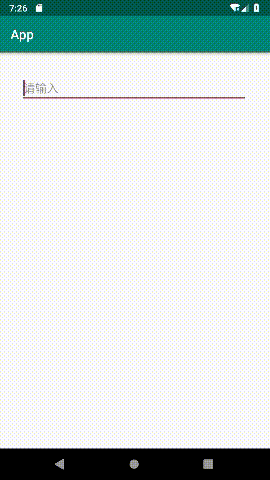

### 1.效果展示



### 2.分析与实现

EditText四周可以设置icon，我们在EditText右边设置icon，点击icon时清除EditText的内容。但是icon没有点击事件，我们需要重写onTouchEvent方法获取点击位置，判断点击位置是否在icon上，点击位置可以通过`getRawX()`
得到，接下来需要获取icon的范围，icon右边坐标为EditText的right减去右边的padding,左边坐标为右边坐标减去icon的宽度，点击功能完成后，我们可以再优化一下，当EditText有内容时显示icon，没有内容时则隐藏icon，关键代码如下:

```java
public class ClearEdit extends AppCompatEditText {
    public boolean onTouchEvent(MotionEvent event) {
        switch (event.getAction()) {
            case MotionEvent.ACTION_UP:
                Drawable drawable = getCompoundDrawables()[2];
                int right = getRight() - getPaddingRight();
                if (drawable != null && Range.create(0, drawable.getBounds().width()).contains((int) (right - event.getRawX()))) {
                    setText("");
                    updateClearIcon();
                }
                break;
        }
        return super.onTouchEvent(event);
    }

    public void updateClearIcon() {
        Editable text = getText();
        boolean show = false;
        if (text != null) {
            show = text.length() > 0;
        }
        Drawable[] drawables = getCompoundDrawablesRelative();
        setCompoundDrawablesRelative(drawables[0], drawables[1], show ? drawable : null, drawables[3]);
    }
}
```

<!-- more -->

### 3.完整代码

在该实现中，不推荐监听内容改变设置显示隐藏操作，这样会与外部监听冲突，我们将监听器交给外部调用处理，内容实现显示隐藏方法，完整代码如下:

```java
public class ClearEdit extends AppCompatEditText {

    private Drawable drawable;

    public ClearEdit(Context context) {
        this(context, null);
    }

    public ClearEdit(Context context, AttributeSet attrs) {
        this(context, attrs, android.support.v7.appcompat.R.attr.editTextStyle);
    }

    public ClearEdit(Context context, AttributeSet attrs, int defStyleAttr) {
        super(context, attrs, defStyleAttr);
        drawable = getCompoundDrawablesRelative()[2];
    }

    public void setClearDrawable(Drawable drawable, boolean show) {
        this.drawable = drawable;
        updateClearIcon();
    }

    @Override
    public boolean performClick() {
        return super.performClick();
    }

    @Override
    public boolean onTouchEvent(MotionEvent event) {
        switch (event.getAction()) {
            case MotionEvent.ACTION_UP:
                performClick();
                Drawable drawable = getCompoundDrawables()[2];
                int right = getRight() - getPaddingRight();
                if (drawable != null && Range.create(0, drawable.getBounds().width())
                        .contains((int) (right - event.getRawX()))) {
                    setText("");
                    updateClearIcon();
                }
                break;
            default:
                break;
        }
        return super.onTouchEvent(event);
    }

    public void updateClearIcon() {
        Editable text = getText();
        boolean show = false;
        if (text != null) {
            show = text.length() > 0;
        }
        Drawable[] drawables = getCompoundDrawablesRelative();
        setCompoundDrawablesRelative(drawables[0], drawables[1], show ? drawable : null, drawables[3]);
    }
}
```

### 4.使用示例

在xml中设置drawableEnd属性或在java代码中调用setClearDrawable方法设置icon

```java
public class Demo {
    public void use() {
        // xml中设置android:drawableEnd="@drawable/ic_clear"，或
        editText.setClearDrawable(drawable);
        editText.addTextChangedListener(new TextWatcher() {
            @Override
            public void beforeTextChanged(CharSequence s, int start, int count, int after) {
            }

            @Override
            public void onTextChanged(CharSequence s, int start, int before, int count) {
            }

            @Override
            public void afterTextChanged(Editable s) {
                edit.updateClearIcon();
            }
        });
        //没有内容时隐藏icon
        editText.setText("");
    }
}
```