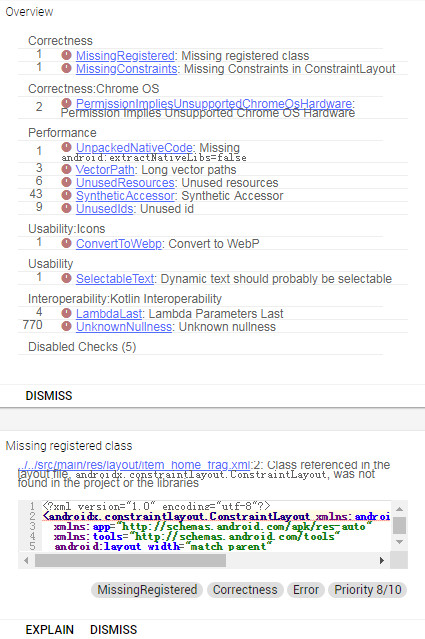
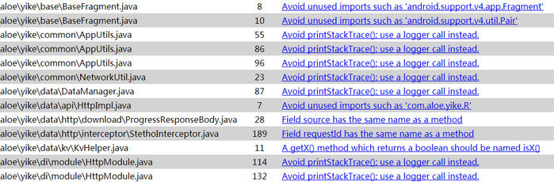
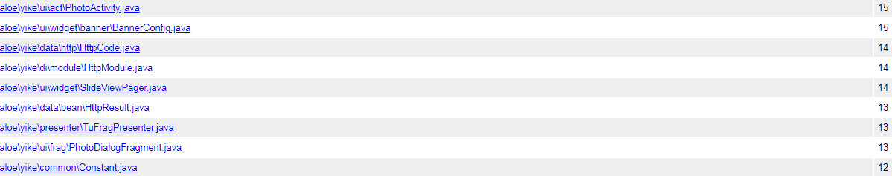
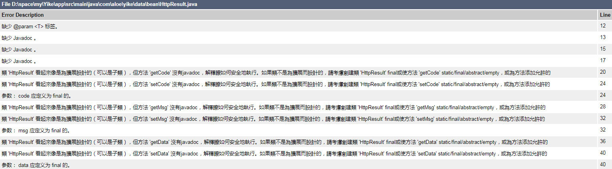

### 1.配置签名信息

在signingConfigs中我们可以配置APP的签名信息，签名版本等，比如我们分别对release和debug使用不同的签名文件，配置如下:

```groovy
signingConfigs {
    release {
        keyAlias 'alias'
        keyPassword '123456'
        storeFile file('../store_release.jks')
        storePassword '1234567'
        v1SigningEnabled true
        v2SigningEnabled true
    }
    debug {
        keyAlias 'alias'
        keyPassword '123456'
        storeFile file('../store_debug.jks')
        storePassword '1234567'
        v1SigningEnabled true
        v2SigningEnabled true
    }
}
```

在使用版本控制工具如git,svn时，这种直接在gradle中显示密码是非常不安全的，我们可以将别名，密码等信息写在gradle.properties文件中，上传代码时忽略此文件，当然其它敏感参数也可以写在此文件中，重新配置如下：

```groovy
KEY_ALIAS = alias
KEY_PASSWORD = 123456
STORE_PASSWORD = 123456

signingConfigs {
    release {
        keyAlias KEY_ALIAS
        keyPassword KEY_PASSWORD
        storeFile file('../store_release.jks')
        storePassword STORE_PASSWORD
        v1SigningEnabled true
        v2SigningEnabled true
    }
}
```

<!-- more -->

### 2.设置编译参数

常见buildTypes配置信息如下:

```groovy
buildTypes {
    release {
        debuggable false
        jniDebuggable false
        minifyEnabled true
        zipAlignEnabled true
        shrinkResources true
        proguardFiles getDefaultProguardFile('proguard-android.txt'), 'proguard-rules.pro'
        signingConfig signingConfigs.release
    }
    debug {
        debuggable true
        jniDebuggable true
        minifyEnabled false
        zipAlignEnabled false
        shrinkResources false
        proguardFiles getDefaultProguardFile('proguard-android.txt'), 'proguard-rules.pro'
        signingConfig signingConfigs.debug
        applicationIdSuffix ".debug"
        versionNameSuffix "-debug"
    }
}
```

其中debuggable是否支持断点调试，jniDebuggable是jni是否能调试，minifyEnabled是否使用代码混淆，zipAlignEnabled是否压缩代码，shrinkResources去除未用资源，proguardFiles混淆文件，signingConfig签名文件，applicationIdSuffix是给applicationId添加后缀,versionNameSuffix是给APP名称添加后缀。

### 3.配置多渠道打包

flavorDimensions可以配置多维度渠道，比如我们配置两个维度，一个是APP类型如APP免费版和付费版，或普通版与精简版等等，另一个维度为各应用市场名称，在这每个渠道中我们可以配置不同的属性字段，配置如下:

```groovy
flavorDimensions 'APP', 'CHANNEL'
productFlavors {
    yike {
        dimension 'APP'
        resValue 'string', 'app_name', '普通版'
    }
    mini {
        dimension 'APP'
        resValue 'string', 'app_name', '精简版'
    }
    huawei {
        dimension 'CHANNEL'
        buildConfigField 'String', 'CHANNEL_ID', '"10001"'
    }
    tencent {
        dimension 'CHANNEL'
        buildConfigField 'String', 'CHANNEL_ID', '"10002"'
    }
}
```

如上所示，每个维度配置了两个渠道，打包时每个维度都会互相组合出现4个应用包yikeHuawei,yikeTencent,miniHuawei,miniTencent。在每个渠道中我们可以添加不同的属性，如添加或修改资源属性，设置不同的APP名称，添加一个渠道ID，在使用buildConfigField时需要注意 **
buildConfigField后台的值会原封不动的设置到BuildConfig中**。 因此我们要设置一个字符串值时，外面的双引号一定不能省略，也不能用单引号。

### 4.配置输出打包

在applicationVariants中我们可以设置输入打包参数，先看一下配置代码:

```groovy
android.applicationVariants.all { variant ->
    variant.outputs.all {
        // println(variant.productFlavors[0].name)
        // println(variant.buildType.name)
        // println(variant.flavorName)
        outputFileName = "${variant.name}_${releaseTime()}_v${variant.versionName}.apk"
    }
}
```

我们可以通过variant.productFlavors来获取所以的维度，返回一个数组，variant.productFlavors[0]
.name获取第一个维度的渠道名称，variant.buildType.name获取编译类型，variant.flavorName获取组合后的名称，releaseTime()获取当前时间，具体实现如下:

```groovy
static def releaseTime() {
    return new Date().format('yyyyMMddHHmm', TimeZone.getTimeZone('GMT+08'))
}
```

设置APP的输出名称`outputFileName = "${variant.name}_${releaseTime()}_v${variant.versionName}.apk"`
,名称为miniHuaweiDebug_201812191641_v1.0.0.apk

### 5.配置生成API

在gradle中配置javadoc自动生成API文档，在配置javadoc时因为我们用到了android sdk中的一此类，因此需要配置android
sdk的编译版本与编译工具的版本，还有一点需要注意，为了兼容中文，我们需要将编码设置为UTF-8，代码中有错误，警告时，我们直接忽略，继续编译，将failOnError的值设为false。我们新建一个gradle文件doc.gradle，内容如下：

```groovy
task javadoc(type: Javadoc) {
    android.compileSdkVersion = versions.compile
    android.buildToolsVersion = versions.build
    source = android.sourceSets.main.java.srcDirs
    classpath += project.files(android.getBootClasspath().join(File.pathSeparator))
}

javadoc {
    options {
        encoding "UTF-8"
        charSet 'UTF-8'
        author true
        version true
        links "http://docs.oracle.com/javase/8/docs/api"
        linksOffline "http://d.android.com/reference", "${android.sdkDirectory}/docs/reference"
        exclude '**/BuildConfig.java'
        exclude '**/R.java'
        failOnError = false
    }
}

project.afterEvaluate {
    preBuild.dependsOn 'javadoc'
}
```

### 6.代码质量检测

#### 6.1配置lint检测

在app.gradle的android标签下配置lintOptions，lint常用功能配置如下:

```groovy
android {
    lintOptions {
        quiet true
        showAll true
        noLines false
        abortOnError false
        ignoreWarnings false
        checkAllWarnings true
        warningsAsErrors true
        xmlReport false
        htmlReport true
        disable 'GoogleAppIndexingWarning'
        lintConfig file("../gradle/config/lint.xml")
        htmlOutput file("$project.buildDir/reports/lint.html")
    }
}
```

quiet设置是否关闭分析进度；showAll是否显示错误发生的完整位置，不截取；noLines是隐藏代码行号；abortOnError发生错误后是否停止gradle构建；ignoreWarnings是否忽略警告，只检测错误；checkAllWarnings是否检测所有警告，包括忽略的；warningsAsErrors是否将警告当作错误处理；xmlReport是否生成xml报告文档；htmlReport是否生成html报告文档；disable关闭指定警告或错误(
enable为打开指定警告或错误)；lintConfig配置语法文件；htmlOutput配置html报告文件。我们先看一下生成的报告文档。  
  
前面是警告错误大纲，列出所有的检测结果，下面是详细信息。比如Overdraw过度绘制，无用的资源等等都可以处理，而有些警告我们可以忽略，比如权限不支持Chrome系统设备上等等。

#### 6.2配置pmd检测

pmd和findbugs类似，都是静态分析代码规范，隐藏bug的工具。我们看一下在gradle中如何配置

```groovy
apply plugin: 'pmd'

task pmd(type: Pmd) {
    ignoreFailures = true
    ruleSetFiles = files('../gradle/config/pmd.xml')
    ruleSets = []
    source 'src/main'
    include '**/*.java'
    exclude '**/gen/**'
    exclude '**/resources/**'
    reports {
        xml.enabled = false
        html.enabled = true
        html {
            destination file("$project.buildDir/reports/pmd.html")
        }
    }
}
```

这里的配置比较简单。如ignoreFailures是否忽略失败，继续检测；ruleSetFiles设置语法文件，source设置检测源文件，html.enabled是否生成html报告文档，destination设置报告文件。我们看一下生成的报告  
  
左边是源文件，右边是警告描述信息。如导入了无用的包或类，属性与方法名相同，应该使用logger代替printStackTrace等等。

#### 6.3配置checkStyle

```groovy
apply plugin: 'checkstyle'

checkstyle {
    toolVersion '8.13'
}

task checkstyle(type: Checkstyle) {
    ignoreFailures true
    showViolations true
    source 'src'
    include '**/*.java'
    exclude '**/gen/**'
    exclude "**/test/**"
    classpath = files()
    configFile file('../gradle/config/checkstyle.xml')
    reports {
        xml.enabled false
        html.enabled true
        html {
            destination file("$project.buildDir/reports/checkstyle.html")
        }
    }
}
```

checkStyle配置信息也比较简单，我们看一下生成的报告。  
  
  
前面是检测结果，后面是详细介绍，我们可以根据介绍的内容来优化我们的代码。

#### 7.扩展

除了上面的介绍，我们还可以做一些其它的配置操作。像配置findBugs静态代码分析，配置SonarQube代码质量分析，配置jenkins自动化构建打包，其中将jenkins与以上代码检测工具结合使用，会让你有意想不到的效果。