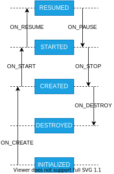

## **事件与状态**

`Lifecycle`有七种事件，除了`ON_ANY`事件，其它事件分别对应差`Activity`或`Fragment`相应的生命同期。`ON_CREATE`，`ON_START`和`ON_RESUME`事件是在生命周期发生后回调，`ON_PAUSE`，`ON_STOP`和`ON_DESTROY`在生命周期发生前回调。这些事件的发生会直接改变相应的状态，`Lifecycle`有5种状态，因为生命周期的改变是有顺序的，这些状态也是有顺序的，相应的顺序也反应着相关的大小，大小顺序为`DESTROYED`<`INITIALIZED`<`CREATED`<`STARTED`<`RESUMED`。**Lifecycle的状态是有大小、有顺序的，这一点非常重要。**  
`Lifecycle`是一个抽象类，3个抽象方法和2个枚举类，为了理解`Lifecycle.Event`中的方法，我们先看一张图。

`downFrom(State)`和`downTo(State)`处理状态`RESUMED`到`DESTROYED`与事件的关系。`downFrom(State)`返回状态后的事件，也就是当前状态接下来要发生的事件，`downTo(State)`返回状态前的事件，也就是当前状态是由什么事件改变成了。`upFrom(State)`和`upTo(State)`处理状态`INITIALIZED`到`RESUMED`与事件的关系。`upFrom(State)`返回状态后的事件，`upTo(State)`返回状态前的事件。`Lifecycle.Event#getTargetState`方法是当前事件的发生，会到达的目标状态。`Lifecycle.State`中只有一个方法`isAtLeast(State)`，将目标状态与当前状态比较，看目标状态是否是最新状态。这里也可以看出状态是有大小的。这里思考一下，为什么会出现不是最新状态的情况呢？放在后面再解释，这里先说结论，`Lifecycle`和`Observer`都有自己的状态，`Observer`会去同步到`Lifecycle`的状态，一个`Lifecycle`可以订阅多个`Observer`，在状态同步的过程中，有先后顺序，会出现有的`Observer`已经同步到最新状态，而有些还没有同步。

## **订阅Observer**

在讲解订阅`Observer`前，需要注意的是：虽然我们绝大多数情况只是在主线程中使用`Lifecycle`，但`Lifecycle`也可以在子线程等多线程中使用。我们从`Lifecycle`的实现类`LifecycleRegistry`的构造方法中可以看到有一个参数`enforceMainThread`是否强制在主线程中使用，我们可以传`false`。`Lifecycle`支持多线程使用，有了这个前提，很多细节就容易理解了。  
首先看一下订阅源码`LifecycleRegistry#addObserver`

```java
public class LifecycleRegistry extends Lifecycle {
  @Override
  public void addObserver(@NonNull LifecycleObserver observer) {
    enforceMainThreadIfNeeded("addObserver");
    State initialState = mState == DESTROYED ? DESTROYED : INITIALIZED;
    // ①
    ObserverWithState statefulObserver = new ObserverWithState(observer, initialState);
    // ②
    ObserverWithState previous = mObserverMap.putIfAbsent(observer, statefulObserver);

    if (previous != null) {
      return;
    }
    // ③
    LifecycleOwner lifecycleOwner = mLifecycleOwner.get();
    if (lifecycleOwner == null) {
      // it is null we should be destroyed. Fallback quickly
      return;
    }
    // ④
    boolean isReentrance = mAddingObserverCounter != 0 || mHandlingEvent;
    // ⑤
    State targetState = calculateTargetState(observer);
    mAddingObserverCounter++;
    // ⑥
    while ((statefulObserver.mState.compareTo(targetState) < 0
        && mObserverMap.contains(observer))) {
      pushParentState(statefulObserver.mState);
      final Event event = Event.upFrom(statefulObserver.mState);
      if (event == null) {
        throw new IllegalStateException("no event up from " + statefulObserver.mState);
      }
      statefulObserver.dispatchEvent(lifecycleOwner, event);
      popParentState();
      // mState / subling may have been changed recalculate
      targetState = calculateTargetState(observer);
    }

    if (!isReentrance) {
      // we do sync only on the top level.
      sync();
    }
    mAddingObserverCounter--;
  }
}
```

### **Observer的包装**

在第①外可以发现`Observer`被包装成了`ObserverWithState`。这里有以下几个作用，首先是让每个`Observer`有自己的状态，其次，在构造方法中发现`observer`被`Lifecycling.lifecycleEventObserver`转成了`LifecycleEventObserver`。

```java
@RestrictTo(RestrictTo.Scope.LIBRARY_GROUP_PREFIX)
public class Lifecycling {
  static LifecycleEventObserver lifecycleEventObserver(Object object) {
    // ③
    boolean isLifecycleEventObserver = object instanceof LifecycleEventObserver;
    boolean isFullLifecycleObserver = object instanceof FullLifecycleObserver;
    if (isLifecycleEventObserver && isFullLifecycleObserver) {
      return new FullLifecycleObserverAdapter((FullLifecycleObserver) object,
        (LifecycleEventObserver) object);
    }
    if (isFullLifecycleObserver) {
      return new FullLifecycleObserverAdapter((FullLifecycleObserver) object, null);
    }

    if (isLifecycleEventObserver) {
      return (LifecycleEventObserver) object;
    }
    // ④
    final Class<?> klass = object.getClass();
    int type = getObserverConstructorType(klass);
    if (type == GENERATED_CALLBACK) {
      List<Constructor<? extends GeneratedAdapter>> constructors =
        sClassToAdapters.get(klass);
      if (constructors.size() == 1) {
        GeneratedAdapter generatedAdapter = createGeneratedAdapter(
            constructors.get(0), object);
          return new SingleGeneratedAdapterObserver(generatedAdapter);
      }
      GeneratedAdapter[] adapters = new GeneratedAdapter[constructors.size()];
      for (int i = 0; i < constructors.size(); i++) {
        adapters[i] = createGeneratedAdapter(constructors.get(i), object);
      }
      return new CompositeGeneratedAdaptersObserver(adapters);
    }
    return new ReflectiveGenericLifecycleObserver(object);
  }
}
```

`Observer`有两种实现方法，一种是实现`LifecycleEventObserver`或`FullLifecycleObserver`等接口的方式，另一种是使用注解的方法来实现。这里分别对这两种方式进行解释，如第③处和第④处，并统一成`LifecycleEventObserver`进行处理。

### **Observer的存储**

在前面第②处，将`observer`以`observer`为key，以`ObserverWithState`为value存储在map中，map的entry是用链表实现了，这样在遍历的时候也能进行增删操作。这里有一点需要注意，**entry是有前后顺序的**。在存储时，若之前已经存过，则直接返回，避免重复注册。

### **LifecycleOwner引用与并发处理**

由于可能在子线程中使用`Lifecycle`，在第③处使用弱引用的方式来避免`LifecycleOwner`在系统回收时导致内存泄漏。  
在第④处有两个判断，`mAddingObserverCounter`是记录正在订阅的数量，`mHandlingEvent`是记录正在处理事件。当订阅的时候，若之前的订阅还没完成或有事件正在处理，这个时候需要对`Observer`的状态进行同步处理。下面的代码可以看到开始处理订阅时`mAddingObserverCounter`会先做加1，当订阅完成后再减1。

### **计算目标状态**

```java
public class LifecycleRegistry extends Lifecycle {
  private State calculateTargetState(LifecycleObserver observer) {
    Map.Entry<LifecycleObserver, ObserverWithState> previous = mObserverMap.ceil(observer);
    State siblingState = previous != null ? previous.getValue().mState : null;
    State parentState = !mParentStates.isEmpty() ? mParentStates.get(mParentStates.size() - 1) : null;
    return min(min(mState, siblingState), parentState);
  }
}
```

第一步是获取前一个`observer`的状态，第二步是获取父状态。父状态对应的集合在两个地方赋值，第一个是订阅时，第二个是处理状态同步时。目标状态为这两个状态的最小值。