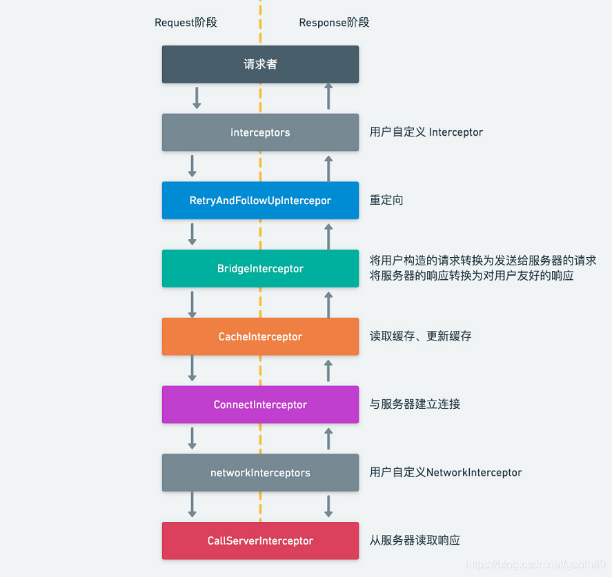

### 1.常用请求方式

OkHttp目前支持六种请求方式，分别是`get`，`post`，`head`，`delete`，`put`，`patch`，下面分别以同步`get`和异步`post`表单请求举例说明。注意同步请求需在子线程中执行，代码如下。

```java
public class Demo {
    public void get() {
        try {
            Response response = new OkHttpClient().newCall(new Request.Builder().url("http://httpbin.org/get").build()).execute();
            if (response.code() == 200) {
                ResponseBody body = response.body();
                if (body != null) {
                    String result = body.string();
                    System.out.println(result);
                }
            }
        } catch (IOException e) {
            e.printStackTrace();
        }
    }

    public void post() {
        new OkHttpClient().newCall(new Request.Builder().url("http://httpbin.org/post")
                .post(new FormBody.Builder().add("name", "aloe").build()).build())
                .enqueue(new Callback() {
                    @Override
                    public void onFailure(Call call, IOException e) {
                        System.out.println(e.getMessage());
                    }

                    @Override
                    public void onResponse(Call call, Response response) {
                        ResponseBody body = response.body();
                        if (body != null) {
                            String result = body.string();
                            System.out.println(result);
                        }
                    }
                });
    }
}
```

另外4种请求方式和`get`，`post`类似，先创建OkHttpClick，再创建Request存放请求链接，参数，最后在Response中接收服务器返回的数据。我们来看一下OkHttp中的配置信息。

<!-- more -->

### 2.OkHttpClick超时配置

OkHttp采用建造者模式来配置参数，非常灵活。在OkHttpClient中我们可以非常轻轻的配置连接和读写超时时间，代码如下:

```java
public class Demo {
    public void use() {
        new OkHttpClient.Builder().connectTimeout(5, TimeUnit.SECONDS).readTimeout(5, TimeUnit.SECONDS).writeTimeout(5, TimeUnit.SECONDS);
    }
}
```

在OkHttpClient中配置缓存目录和缓存大小也很方便，代码如下:

```java
public class Demo {
    public void use() {
        new OkHttpClient.Builder().cache(new Cache(new File(filePath)), CACHE_SIZE);
    }
}
```

### 3.OkHttpClick Cookie配置

在网络请求中对数据持久化处理是必不可少的，OkHttp配置Cookie持久化也非常方便，不过具体怎么持久化需要开发者自己实现，我们需要做的事情是在Request中添加cookie，在response中持久化保存cookie。OkHttpClient的参数有个cookieJar，CookieJar接口中有两个方法，`loadForRequest`
将Cookie添加到请求中，`saveFromResponse`将服务器返回的cookie保存在本地或内存中。代码如下:

```java
public class Demo {
    public void use() {
        new OkHttpClient.Builder().cookieJar(new CookieJar() {
            private Set<Cookie> cookieSet = new ArraySet<>();

            @Override
            public void saveFromResponse(HttpUrl url, List<Cookie> cookies) {
                cookieSet.addAll(cookies);
            }

            @NonNull
            @Override
            public List<Cookie> loadForRequest(HttpUrl url) {
                List<Cookie> validCookies = new ArrayList<>();
                for (Iterator<Cookie> it = cookieSet.iterator(); it.hasNext(); ) {
                    Cookie currentCookie = it.next();
                    if (currentCookie.expiresAt() < System.currentTimeMillis()) {
                        it.remove();
                    } else if (currentCookie.matches(url)) {
                        validCookies.add(currentCookie);
                    }
                }
                return validCookies;
            }
        });
    }
}
```

上面只是将cookie保存在内存中，当APP退出下次打开时，我们的cookie就丢失了，这里我们用SharedPreferences将cookie保存在本地，使用SharedPreferences前我们需要对Cookie做序列化处理，在此我们略过这一步骤，我们以url链接为key,cookie序列化为值存在本地，代码如下:

```java
public class PersistentCookieJar implements CookieJar {
    private SetCookieCache cache;
    private SharedPrefsCookiePersistor persistor;

    public PersistentCookieJar(Context context) {
        persistor = new SharedPrefsCookiePersistor(context);
        cache = new SetCookieCache();
        cache.addAll(persistor.loadAll());
    }

    @Override
    public synchronized void saveFromResponse(@NonNull HttpUrl url, @NonNull List<Cookie> cookies) {
        cache.addAll(cookies);
        persistor.saveAll(filterPersistentCookies(cookies));
    }

    private List<Cookie> filterPersistentCookies(List<Cookie> cookies) {
        List<Cookie> persistentCookies = new ArrayList<>();
        for (Cookie cookie : cookies) {
            if (cookie.persistent()) {
                persistentCookies.add(cookie);
            }
        }
        return persistentCookies;
    }

    @NonNull
    @Override
    public synchronized List<Cookie> loadForRequest(@NonNull HttpUrl url) {
        List<Cookie> cookiesToRemove = new ArrayList<>();
        List<Cookie> validCookies = new ArrayList<>();
        for (Iterator<Cookie> it = cache.iterator(); it.hasNext(); ) {
            Cookie currentCookie = it.next();
            if (currentCookie.expiresAt() < System.currentTimeMillis()) {
                cookiesToRemove.add(currentCookie);
                it.remove();
            } else if (currentCookie.matches(url)) {
                validCookies.add(currentCookie);
            }
        }
        persistor.removeAll(cookiesToRemove);
        return validCookies;
    }
}
```

完整cookie持久化实现代码可参考这个链接[PersistentCookieJar](https://github.com/franmontiel/PersistentCookieJar)

### 4.OkHttp拦截器配置

OkHttp有两个拦截器，一种是应用拦截器，一种是网络拦截器，两者差别不大细微差别如下:  
应用拦截器:

* 不需要担心重定向或者重试
* 始终调用一次，包括从缓存获取
* 关注应用程序的初衷，不关心OkHttp添加注入的头信息，如If-None-Match
* 允许终止调用Chain.proceed()或多次调用Chain.proceed()

网络拦截器:

* 能够对重定向或重试进行操作
* 当网络短路而返回缓存时不被调用
* 只观察网络上的数据传输

添加应用拦截器使用addInterceptor()，添加网络拦截器使用addNetworkInterceptor()，这里有一张拦截器的示意图。  
  
我们所有的请求和返回都会经过拦截器，因此在拦截器里面我们可以做很多事情，常见的如日志打印，添加全局参数，动态修改Url域名，网络判断优化请求等等，下面我们以应用拦截器讲解说明。

### 5.OkHttp拦截器应用

#### 5.1日志打印

在拦截器中我们可以通过Request获取请求链接，参数以及头部信息，通过Response来获取服务器返回的数据，这样就不用在每个接口回调中打印日志了，日志拦截器代码如下:

```java
public class LoggingInterceptor implements Interceptor {
    @Override
    public Response intercept(Interceptor.Chain chain) throws IOException {
        Request request = chain.request();

        long t1 = System.nanoTime();
        logger.info(String.format("Sending request %s on %s%n%s",
                request.url(), chain.connection(), request.headers()));

        Response response = chain.proceed(request);

        long t2 = System.nanoTime();
        logger.info(String.format("Received response for %s in %.1fms%n%s",
                response.request().url(), (t2 - t1) / 1e6d, response.headers()));

        return response;
    }
}
```

我们调用addInterceptor(new LoggingInterceptor())
;就可以打印日志了，完整代码请查看[LoggingInterceptor](https://github.com/square/okhttp/tree/master/okhttp-logging-interceptor)

#### 5.2动态更换域名

我们经常会遇到开发调试过度中会不断的切换测试服务器和线上服务器，两个服务器只是域名不一样，每次切换都重新打包APP效率非常低，我们将url写成变量每次根据不同环境获取不同的链接似乎可以，但通常我们我url定义成static
final类型，定义成变量全局获取不太方便。因此我们可以在头部做个标记是否需要切换域名，在拦截器中获取该头部动态设置测试环境或线上环境域名，代码如下:

```java
public class MultipleUrlInterceptor implements Interceptor {
    public static boolean ONLINE = false;

    @NonNull
    @Override
    public Response intercept(@NonNull Chain chain) throws IOException {
        Request request = chain.request();
        HttpUrl url = request.url();
        String host;
        Request.Builder builder = request.newBuilder();
        String hostNew = request.header("hostNew");
        if (TextUtils.isEmpty(hostNew)) {
            host = url.host();
        } else {
            if (ONLINE) {
                host = "online_host";
            } else {
                host = "offline_host";
            }
        }
        HttpUrl newUrl = url.newBuilder().scheme(url.scheme())
                .host(host).port(url.port()).build();
        return chain.proceed(builder.url(newUrl).build());
    }
}
```

在此我们可以通过Request来动态添加全局参数，头部如User-Agent，Token等等，大家可以自己尝试。

#### 5.3网络优化处理

有时候我们为了防止别人恶意对APP请求数据进行抓包，可以判断当前网络是否设置了代理，若设置了代理，则不请求服务器，直接使用缓存数据，可能有些国外业务需要用户使用代理访问，大家需要根据实现情况来处理。当没有网络时，可以直接使用缓存数据，能使用户得到更好的体验。这里没有判断是否有网络不推荐直接判断手机网络状态，有时候虽然连接了wifi，但依然无法上网。大家可以通过ping指令来来判断，看能否ping通自己的域名或直接ping某度都可以达到目的。主要代码如下:

```java
public class CacheInterceptor implements Interceptor {
    private static final long NO_NET_TIME = 1000L;
    private static final String CACHE_HEAD = "Cache-Control";

    @Override
    public final Response intercept(final Chain chain) throws IOException {
        Request request = chain.request();
        if (isNetWorkAvailable() && !isWifiProxy()) {
            return chain.proceed(request).newBuilder().removeHeader("pragma")
                    .removeHeader(CACHE_HEAD)
                    .header(CACHE_HEAD, "public, max-age=0")
                    .build();
        } else {
            SystemClock.sleep(NO_NET_TIME);
            request = request.newBuilder().cacheControl(CacheControl.FORCE_CACHE).build();
            return chain.proceed(request).newBuilder()
                    .header(CACHE_HEAD, "public, only-if-cached")
                    .removeHeader("Pragma").build();
        }
    }
}
```

### 6.https的处理

通常我们访问https链接时，需要相应的证书，我们可以将证书文件放在assets目录下，请求的时候加载证书，代码如下

```java
public class Demo {
    public OkHttpClient getKeyStoreClient(Context context, OkHttpClient.Builder builder, String alias) {
        try (InputStream stream = context.getAssets().open(alias + ".cer")) {
            CertificateFactory factory = CertificateFactory.getInstance("X.509");
            KeyStore keyStore = KeyStore.getInstance(KeyStore.getDefaultType());
            keyStore.load(null);
            keyStore.setCertificateEntry(alias, factory.generateCertificate(stream));
            TrustManagerFactory managerFactory = TrustManagerFactory.getInstance(TrustManagerFactory
                    .getDefaultAlgorithm());
            managerFactory.init(keyStore);
            SSLContext sslContext = SSLContext.getInstance("TLS");
            sslContext.init(null, managerFactory.getTrustManagers(), new SecureRandom());
            builder.sslSocketFactory(sslContext.getSocketFactory(), new X509TrustManager() {
                @Override
                public void checkClientTrusted(X509Certificate[] chain, String authType) throws CertificateException {

                }

                @Override
                public void checkServerTrusted(X509Certificate[] chain, String authType) throws CertificateException {

                }

                @Override
                public X509Certificate[] getAcceptedIssuers() {
                    return new X509Certificate[0];
                }
            });
        } catch (Exception e) {
            e.printStackTrace();
        }
        return builder.build();
    }
}
```

当我们在做聚合类APP时，这些接口都是别人的，每个证书都不一样，这样配置非常麻烦也浪费性能，因为这些请求的OkHttpClient配置仅仅只是证书不一样。其实OkHttp支持不配置证书访问https，不过这样处理会大大降低安全性，大家视情况而定，具体代码如下:

```java
public class Demo {
    public OkHttpClient getClient(final OkHttpClient.Builder builder) {
        try {
            X509TrustManager manager = new X509TrustManager() {
                @Override
                public void checkClientTrusted(X509Certificate[] chain, String authType) throws CertificateException {

                }

                @Override
                public void checkServerTrusted(X509Certificate[] chain, String authType) throws CertificateException {

                }

                @Override
                public X509Certificate[] getAcceptedIssuers() {
                    return new X509Certificate[0];
                }
            };
            SSLContext sslContext = SSLContext.getInstance("TLS");
            sslContext.init(null, new TrustManager[]{manager}, new SecureRandom());
            builder.sslSocketFactory(sslContext.getSocketFactory(), manager)
                    .hostnameVerifier((hostname, session) -> true);
        } catch (GeneralSecurityException e) {
            e.printStackTrace();
        }
        return builder.build();
    }
}
```