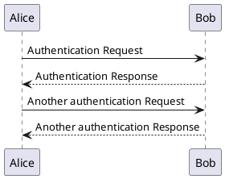
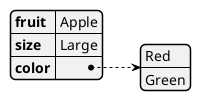
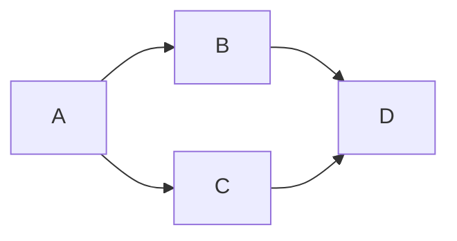

---
title: Test
...

# Test!

This is a test of *pandoc*.

- list one
- list two

```puml
@startuml
Alice -> Bob: Authentication Request
Bob --> Alice: Authentication Response

Alice -> Bob: Another authentication Request
Alice <-- Bob: Another authentication Response
@enduml

```

```puml
@startjson
{
   "fruit":"Apple",
   "size":"Large",
   "color": ["Red", "Green"]
}
@endjson

```

```mermaid
graph LR;
    A --> B
    A --> C
    B --> D
    C --> D
```
