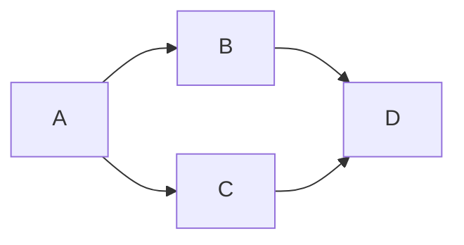

---
title: Test
...

# Test!

This is a test of *pandoc*.

- list one
- list two

```puml
A -> B : How are you
B --> A : fine!
```

```mermaid
graph LR;
    A --> B
    A --> C
    B --> D
    C --> D
```
